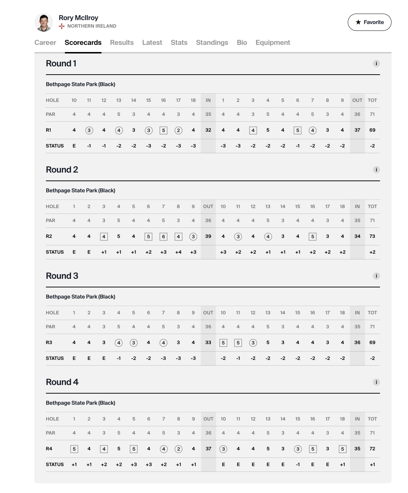

# https://www.pgatour.com/player/28237/rory-mcilroy/scorecards



## Request

```json
{
  "operationName": "ScorecardCompressedV3",
  "variables": { "tournamentId": "R2012027", "playerId": "28237" },
  "query": "query ScorecardCompressedV3($tournamentId: ID!, $playerId: ID!) {\n  scorecardCompressedV3(tournamentId: $tournamentId, playerId: $playerId) {\n    id\n    payload\n  }\n}"
}
```

## response

```json
{
  "data": {
    "scorecardCompressedV3": {
      "id": "R2012027-28237",
      "payload": "H4sIAAAAAAAAA92ab2/iRhDGvwqavmmFU3nX//0uuSYt0h2JCK1UVdVpMZvEioPp2pyKonz3yoRw4JmuB86nU/uOYKPHM7vz7G/GeYaPH+v1Ui/Uk4YUbrPS6EyZ+W8eOFCXK9NcWNTj18vTBz24UCYr1LoCB/I5pDCRrpCujM5kLL0IHMhWxuhFPSlXizmkvgMzlT2O84WG9E4VlXbg3pSr5Xj1NNMG0jPhwLJQ6+bzM6jZzOhPuarzclFBCuAcfnWeZbqq8lle5PV6qv+ut/c8qVqvzE4hK1eL2qwhhfFoAru/rwp1v/tunleN7ja0SWnWgw/ZqDDlGhy4y01V7116i/YtyELtLn/+UfVQmta3zmDyY3N7vtDvyqI0kMJ3rhv7V1fw4oBpcrTJeQXpH8+HazHZXdwE8LQsdK0hrc1K75L8S1loSJN20rdZeA1ik/lneCiLrUrz6S37wnVgqcxmnaqNVgp+E4r+a6UX2e4+14GqVvWqWZOb8yZ9a2Xm6l5D6sfefiSQwiW8OC0ZgWU8QkbsyVyMJj+NLg+UPLeldCawlORFJC0RRe2IKB1vqxPYdTxrSKEbtaUklvK3Up49e/6/hyQilDpCJ+CtUmBfpVi0pTwsFWKpgJAK96Wuf778/XCdfEZQEU6eJJQia1DSjRlBxbytF1u2XrN9kc6fjRfXqnivZrqAFEZj2ChNmy8h9YLt9Wa9mgxApbNyMe8ofd7DJpaHlYykMMtRWBzGi8JuHQ8vM6kjbDtKekn3jvJx4VNbV1gcJhCMciSqkYzIszlZ0K3DLEXh2zLnJWiNsGdGPMsUdoMJPEbZxzzLFKHFMxOGNyfMRYosixSi40bimr/+dXpY9OFe0Uc7mtir7gPMcjcQZCq95ZMLXT8s1b0e3Naq1oMbZR4H318UKnv8Ad5uPd8jr+YnN7sro4aFwjg5eKJIfH6isLm0Sci0vGny85a7ExGnsdaTGefLEUe2bQEjDtfnLDYXt70fqzBdTlpNTrYP6CEuVabJWbwnkO1tTcgwPc5CNn7Uzhohw7S4wEobbttLh9gOCIcLj8WawGsfq0N83BH+RiUusm4Et30KDX2OwVFGGtuZEJHakMAaq8UlbK5htjQ2sEnQ1iVoj9vTuB1NDapGAmK57mKxl4Czf7ldzQHcEEc0TiDRQTHbGhvgiABtLEKIS1I2m/E5QlyUshtNjOqf19YcDzio/gkhZlNjJRxBRXRMV+MjwJHfFnAirw04w/8y4Ig2vX8dwGnvNxbgUNva0luJpBvWCLo5fnZDNHEswOka3VDHJ2q0WW0cFVNgWZ8EDR9YhEPJhB2pQ302C3Go1Fl8R0pqmnJaB2cb2kSoUTyWbrwvoRvqiEmsJwxu1gnjJ2yFPMxcq5REueHNbMnDrGM+jKiDCosgnGPHNyFnfNML3viMiuwFbwLGoIjCm875DUJrTup6gRvOZugDbvBo+Ei4CRHceP/36c3rTaexDVWtdg9CU12C3XvAG84kop8BDhI6eUptHeAwOlPCeygZ6+yYng70jje+i+LBMv3gDZ7gsCbUx7+XEogMiT3XA+GEVPd7/Ij6VMKhzD/pYIH2E/PeSh/7bgq/AyN0epneMOLpA21QkRA6fZBN2N2lcd9Hi47uKURs89VGN5yoeoAbPLkldAi2ISOyzog91E1TlW+jmwDRjf+NRzcSjW5eQ0LM8vp/SZungBTeXX+4eX85bfbWQz7Xt+Wn3ZBmacq7vNCXCzUr9BZvXv4BzTS4oFwlAAA="
    }
  }
}
```

## headers

Request URL:
https://orchestrator.pgatour.com/graphql

Request Method:
POST

Status Code:
200 OK

Remote Address:
18.154.253.71:443

Referrer Policy:
strict-origin-when-cross-origin

access-control-allow-credentials:
true

access-control-allow-origin:
https://www.pgatour.com

access-control-expose-headers:
x-pgat-platform,x-api-key,content-type,x-amz-\*,authorization,previewmode

content-encoding:
br

content-type:
application/json

date:
Sat, 08 Feb 2025 22:44:03 GMT

server:
CloudFront

vary:
Accept-Encoding

vary:
Origin

via:
1.1 57b1e37923c255dd954983b66605bf54.cloudfront.net (CloudFront)

x-amz-cf-id:
yNmgQWrxvKMA24pKGaLJKr-JZbRQuqq_rMvMWpySFVQSm66m--Al4A==

x-amz-cf-pop:
DFW56-P8

x-cache:
Miss from cloudfront

:authority:
orchestrator.pgatour.com

:method:
POST

:path:
/graphql

:scheme:
https

accept:
_/_

accept-encoding:
gzip, deflate, br, zstd

accept-language:
en-US,en;q=0.9

cache-control:
no-cache

content-length:
282

content-type:
application/json

origin:
https://www.pgatour.com

pragma:
no-cache

priority:
u=1, i

referer:
https://www.pgatour.com/

sec-ch-ua:
"Not(A:Brand";v="99", "Google Chrome";v="133", "Chromium";v="133"

sec-ch-ua-mobile:
?1

sec-ch-ua-platform:
"Android"

sec-fetch-dest:
empty

sec-fetch-mode:
cors

sec-fetch-site:
same-site

user-agent:
Mozilla/5.0 (Linux; Android 6.0; Nexus 5 Build/MRA58N) AppleWebKit/537.36 (KHTML, like Gecko) Chrome/133.0.0.0 Mobile Safari/537.36

x-amz-user-agent:
aws-amplify/3.0.7

x-api-key:
da2-gsrx5bibzbb4njvhl7t37wqyl4

x-pgat-platform:
web
